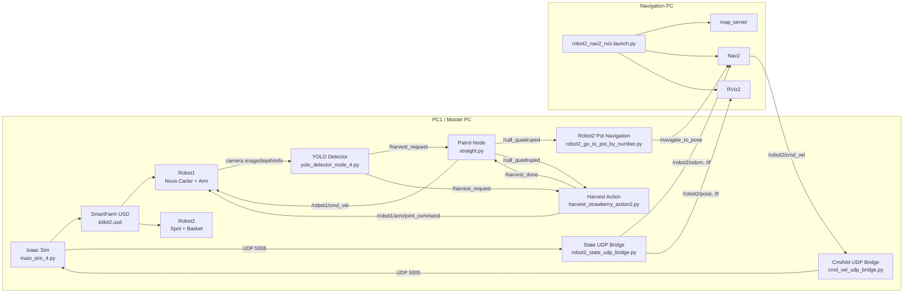

# 🍓 SmartFarm Dual-Robot Harvest & Transport System

<p align="center">
  <b>ROS2 Humble · NVIDIA Isaac Sim · Nav2 · YOLO · Nova Carter · Spot</b>
</p>

<p align="center">
  
  
  
  
  
</p>

---

## 📌 Overview

이 프로젝트는 **스마트팜 환경에서 두 대의 로봇이 협업하여 딸기 수확과 운반을 수행하는 ROS2 기반 시뮬레이션 시스템**입니다.

- **Robot1: Nova Carter + 로봇팔**  
  화분 라인을 순찰하고, 카메라와 YOLO를 이용해 익은 딸기를 인식한 뒤 로봇팔로 수확합니다.

- **Robot2: Spot + Basket**  
  Robot1의 호출 신호를 받아 해당 화분 위치로 이동하고, 바구니가 가득 차면 창고로 이동해 수확물을 운반합니다.

전체 시스템은 **Isaac Sim 시뮬레이션**, **YOLO 기반 인식**, **ROS2 topic/service/action 통신**, **Nav2 자율주행**, **UDP bridge 기반 Spot 제어**로 구성됩니다.

> **Note:** SmartFarm USD 씬 `kitkit2.usd`는 100MB 초과로 깃허브에서 제외되었습니다. 별도로 공유된 파일을 `resource/` 폴더에 넣어주세요.

---

## 🧭 Table of Contents

- [Key Features](#-key-features)
- [System Architecture](#-system-architecture)
- [Repository Structure](#-repository-structure)
- [Main Nodes](#-main-nodes)
- [Topics, Services, Actions](#-topics-services-actions)
- [Environment](#-environment)
- [Installation](#-installation)
- [How to Run](#-how-to-run)
- [Test Commands](#-test-commands)
- [Troubleshooting](#-troubleshooting)
- [Notes](#-notes)

---

## ✨ Key Features

### 1. Robot1: Patrol, Detection, Harvest

- Nova Carter가 스마트팜 내부 화분 라인을 순찰합니다.
- Isaac Sim 카메라에서 RGB, Depth, CameraInfo 데이터를 ROS2 topic으로 발행합니다.
- YOLO detector가 익은 딸기를 인식하고 3D 좌표를 계산합니다.
- 로봇팔이 인식된 딸기를 수확하고 바구니에 넣습니다.
- 수확 지점 정보를 Robot2에게 `/call_quadruped` topic으로 전달합니다.

### 2. Robot2: Navigation, Transport, Storage Cycle

- Robot2는 `/call_quadruped` 메시지를 받아 몇 번째 화분으로 이동할지 판단합니다.
- Nav2의 `/navigate_to_pose` action을 이용해 목표 위치로 이동합니다.
- Robot2의 바구니 적재량이 기준치에 도달하면 창고 왕복 시나리오를 수행합니다.

### 3. Isaac Sim ↔ ROS2 Bridge

- Isaac Sim 내부 Spot policy는 UDP 5005로 속도 명령을 받습니다.
- Spot의 현재 위치는 UDP 5006으로 ROS2 bridge에 전달됩니다.
- ROS2에서는 `/robot2/odom`, `/robot2/pose`, `/tf`를 통해 Nav2와 RViz에서 Robot2 상태를 확인합니다.

---

## 🏗 System Architecture



---

## 📁 Repository Structure

```
.
├── README.md
├── main_sim_4.py                       # Isaac Sim 메인 시뮬레이션
├── yolo_detector_node_4.py             # YOLO 딸기 감지
├── straight.py                         # Robot1 순찰 제어
├── harvest_strawberry_action2.py       # 로봇팔 수확 액션 (PPO, grap_str_model1.pt 사용)
├── harvest_strawberry_action_ik.py     # 로봇팔 수확 액션 IK 버전 (미사용)
├── robot2_go_to_pot_by_number.py       # Robot2 화분 이동
├── cmd_vel_udp_bridge.py               # Robot2 cmd_vel → UDP 5005
├── robot2_state_udp_bridge.py          # UDP 5006 → ROS2 odom/tf
├── robot2_nav2_params.yaml             # Nav2 파라미터
├── robot2_spot.rviz                    # RViz 설정
├── launch/
│   └── robot2_nav2_rviz.launch.py      # Nav2 + map_server + RViz 실행
├── maps/
│   ├── carter_warehouse_navigation.yaml
│   └── carter_warehouse_navigation.png
└── resource/
    ├── best_10n_isaac.pt               # YOLO 모델 (Isaac Sim용)
    ├── best_10n.pt                     # YOLO 모델
    ├── grap_str_model1.pt              # 수확 PPO 정책 모델 (사용중)
    ├── grap_str_model.pt               # 수확 PPO 정책 모델 (구버전)
    └── kitkit2.usd                     # SmartFarm USD 씬 (100MB↑, 별도 공유)
```

---

## 🧩 Main Nodes

| Node / File | Role | Main Input | Main Output |
|---|---|---|---|
| `main_sim_4.py` | Isaac Sim 통합 시뮬레이션 실행 | UDP 5005 | Camera topics, UDP 5006 |
| `yolo_detector_node_4.py` | 익은 딸기 검출 및 3D 좌표 계산 | RGB / Depth / CameraInfo | `/harvest_request` |
| `straight.py` | Robot1 순찰 및 Robot2 호출 | `/harvest_request`, `/harvest_done` | `/robot1/cmd_vel`, `/call_quadruped` |
| `harvest_strawberry_action2.py` | 로봇팔 수확 및 그리퍼 제어 (PPO) | `/call_quadruped`, `/harvest_request` | `/robot1/arm/joint_command`, `/harvest_done` |
| `robot2_go_to_pot_by_number.py` | Robot2 화분 이동 goal 생성 | `/call_quadruped` | `/navigate_to_pose` |
| `cmd_vel_udp_bridge.py` | Robot2 cmd_vel을 Isaac Sim UDP로 전달 | `/robot2/cmd_vel` | UDP 5005 |
| `robot2_state_udp_bridge.py` | Isaac Sim Robot2 pose를 ROS2 odom/tf로 변환 | UDP 5006 | `/robot2/odom`, `/robot2/pose`, `/tf` |
| `robot2_nav2_rviz.launch.py` | Nav2, map_server, RViz 실행 | map yaml, params | Nav2 stack, RViz2 |

---

## 🔌 Topics, Services, Actions

### Robot1 Topics

| Name | Type | Description |
|---|---|---|
| `/robot1/cmd_vel` | `geometry_msgs/Twist` | Nova Carter 이동 명령 |
| `/harvest_request` | `std_msgs/String` | YOLO가 검출한 딸기 3D 좌표 JSON |
| `/harvest_done` | `std_msgs/Bool` | 수확 완료 신호 |
| `/robot1/arm/joint_command` | `sensor_msgs/JointState` | 로봇팔 관절 명령 |
| `/robot1/gripper/command` | `std_msgs/Float64` | 그리퍼 제어 명령 |

### Robot1 → Robot2 Call Topic

| Name | Type | Description |
|---|---|---|
| `/call_quadruped` | `std_msgs/String` | Robot2 호출 메시지 |

Example:

```json
{
  "strawberry": {"x": -1.86, "y": -0.49, "z": 2.34},
  "pot_stop": 3
}
```

### Robot2 Topics / Actions

| Name | Type | Description |
|---|---|---|
| `/robot2/cmd_vel` | `geometry_msgs/Twist` | Spot 속도 명령 |
| `/robot2/odom` | `nav_msgs/Odometry` | Robot2 odometry |
| `/robot2/pose` | `geometry_msgs/PoseStamped` | Robot2 현재 위치 |
| `/tf` | `tf2_msgs/TFMessage` | Robot2 TF tree |
| `/navigate_to_pose` | `nav2_msgs/action/NavigateToPose` | Nav2 목표 이동 action |

---

## 🖥 Environment

| Item | Version / Description |
|---|---|
| OS | Ubuntu 22.04 LTS |
| ROS2 | Humble |
| Simulator | NVIDIA Isaac Sim |
| Navigation | Nav2 |
| Vision | YOLO / Ultralytics |
| Language | Python 3.10 |
| Main Libraries | `rclpy`, `nav2_msgs`, `cv_bridge`, `message_filters`, `ultralytics`, `opencv-python`, `numpy`, `torch` |

---

## 📦 Installation

### 1. ROS2 Packages

```bash
sudo apt update
sudo apt install -y \
  ros-humble-navigation2 \
  ros-humble-nav2-bringup \
  ros-humble-cv-bridge \
  ros-humble-message-filters \
  ros-humble-tf2-ros \
  ros-humble-tf2-geometry-msgs
```

### 2. Python Packages

```bash
pip install ultralytics opencv-python numpy torch
```

### 3. 모든 터미널 공통 설정

```bash
source /opt/ros/humble/setup.bash
export ROS_DOMAIN_ID=135
export ROS_LOCALHOST_ONLY=0
```

---

## 🚀 How to Run

> 클론한 디렉토리(`D1_strawberry_src/`) 안에서 실행합니다.

### Terminal 1. Nav2 + RViz

```bash
ros2 launch launch/robot2_nav2_rviz.launch.py
```

### Terminal 2. Robot2 State Bridge

```bash
python3 robot2_state_udp_bridge.py
```

### Terminal 3. Robot2 CmdVel Bridge

```bash
python3 cmd_vel_udp_bridge.py
```

### Terminal 4. YOLO Detector

```bash
python3 yolo_detector_node_4.py
```

### Terminal 5. Robot1 Patrol

```bash
python3 straight.py
```

### Terminal 6. Robot1 Harvest Action

```bash
python3 harvest_strawberry_action2.py
```

### Terminal 7. Robot2 Pot Navigation

```bash
python3 robot2_go_to_pot_by_number.py
```

### Terminal 8. Isaac Sim ⚠️ 마지막에 실행

위 7개 터미널 모두 실행 확인 후:

```bash
isaac-python main_sim_4.py
```

> Isaac Sim을 마지막에 실행해야 YOLO 감지 화면이 정상적으로 뜹니다.

---

## 🧪 Test Commands

### Robot2 pose 확인

```bash
ros2 topic echo /robot2/pose --once
```

### Robot2 TF 확인

```bash
ros2 run tf2_ros tf2_echo map robot2/base_link
```

### Robot2 호출 테스트

```bash
ros2 topic pub -1 /call_quadruped std_msgs/msg/String \
"{data: '{\"strawberry\": {\"x\": -1.86, \"y\": -0.49, \"z\": 2.34}, \"pot_stop\": 3}'}"
```

### Robot2 속도 명령 확인

```bash
ros2 topic echo /robot2/cmd_vel
```

---

## 🧯 Troubleshooting

### 1. Robot1과 Robot2가 같이 움직임

`/cmd_vel` 토픽을 공유하고 있을 가능성이 높습니다.

```bash
ros2 topic info /cmd_vel -v
ros2 topic info /robot2/cmd_vel -v
```

### 2. Robot2가 움직이지 않음

```bash
ros2 topic echo /robot2/cmd_vel
ros2 topic echo /robot2/pose
ros2 run tf2_ros tf2_echo map robot2/base_link
```

### 3. RViz 맵이 안 뜸

```bash
ros2 lifecycle set /map_server configure
ros2 lifecycle set /map_server activate
```

RViz Map Display 설정: `Reliability: Reliable` / `Durability: Transient Local`

### 4. YOLO 화면이 안 뜸

Isaac Sim이 실행되어 카메라 토픽을 발행해야 화면이 뜹니다.

```bash
ros2 topic hz /robot1/left_hawk/left/image_raw
```

---

## ✅ Checklist Before Demo

- [ ] 모든 터미널 `ROS_DOMAIN_ID=135` 설정
- [ ] 모든 터미널 `ROS_LOCALHOST_ONLY=0` 설정
- [ ] `kitkit2.usd`를 `resource/` 폴더에 배치
- [ ] Isaac Sim 씬 정상 로드 확인
- [ ] `/robot2/pose` 발행 확인
- [ ] `map → robot2/odom → robot2/base_link` TF 확인
- [ ] RViz Map Display `Transient Local` 설정

---

## 📌 Notes

- Robot1과 Robot2는 `/cmd_vel`을 공유하지 않습니다.
- Isaac Sim Spot policy는 UDP 5005로 속도 명령을 수신합니다.
- Robot2 odometry와 TF는 UDP 5006 패킷에서 생성됩니다.
- `harvest_strawberry_action_ik.py`는 IK 버전으로 현재 미사용입니다.
